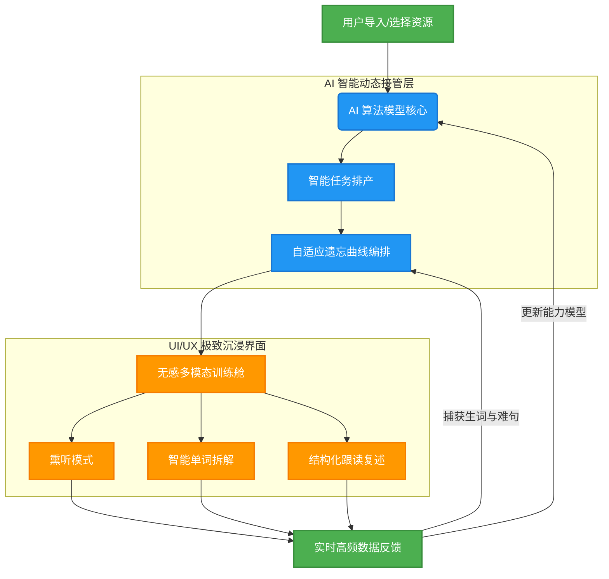

# EnglishGo!

> **AI 算法模型驱动的“无感”自主英语学习系统**

`EnglishGo!` 不是一款简单的音视频播放器，也不是机械低效的背单词工具。它是一款由 **AI 算法模型核心驱动** 的深度学习软件。它打破了传统学习中“内容、练习、复习”彼此割裂的现状，将课程、音频、动态字幕、多维练习、生词库及复习曲线全自动无缝串联，为你打造一个**无感过渡、自适应循环**的闭环学习生态。

---

## 💡 我们想解决什么？

在传统的英语自学路径中，用户常常陷入两个致命的断层：
1. **决策瘫痪**：面对海量内容，每天醒来不知道该学什么，把时间浪费在挑选和规划上。
2. **无效输入**：听了成百上千小时的“磨耳朵”材料，由于缺乏稳定的输出训练，依然无法开口。

`EnglishGo!` 的核心使命就是用 **AI 技术** 彻底消除这两个断层：
* **智能任务化**：AI 算法自动解构你导入或选择的音频内容，将其一键转化为高度可执行的每日渐进式学习流。
* **输入到输出的“无感过渡”**：利用自适应算法，在不知不觉中引导你从“盲听/精听”的被动输入，平滑过渡到“跟读、复述、多维评测”的主动输出训练。

---

## 🚀 核心训练体验：AI 驱动的闭环回路

在 `EnglishGo!` 中，你不需要刻意去想“接下来该做什么”。一次标准的学习心流会自然发生：


```

[资源导入/选择] ➔ [AI 算法智能排产] ➔ [熏听/精听/交互练习] ➔ [难句收藏/生词捕获] ➔ [自适应动态复习]

```

* **自适应规划**：进入课程后，AI 算法会根据你当前的能力模型与遗忘曲线，精准派发当天的训练配额。
* **无感多模态切换**：系统将根据你的听写正确率与跟读表现，自动在**盲听、精听、单词拆解、结构练习**等模式间动态切分，拒绝盲目机械的“刷进度”，确保每一次交互都是**有高频反馈的有效练习**。
* **数据留痕与复现**：所有在训练中暴露的生词、难句和语法盲点将被自动捕获，并在后续的复习流中以最高优先级重新编排回练。

---

## 📅 路线图与上线排期 (Roadmap & Timeline)

目前项目正处于高频迭代的冲刺阶段，整体开发进度已完成 **95%**。以下是明确的上线时间节点：

- **[已完成] 核心算法打通 (2025.Q4)**：完成 AI 智能排产与自适应动态复习底层逻辑构建。
- **[进行中] 界面高保真重构 (2026.Q1)**：正在进行iOS、iPadOS、安卓端全新 UI/UX 重构，引入更具现代抽象化设计自适应布局。
- **[即将到来] 核心公测 (2026.06)**：预计于 2026 年 7 月开启第一轮 TestFlight 独家内测。
- **[正式发布] 全量上架 (2026.07)**：预计于 2026 年第三季度正式登陆 App Store 商店、Google play。
- **[全端打通] 全量上架 (2026.10)**：预计于 2026 年第四季度完成iOS、iPad、安卓、鸿蒙、macOS端全量上架。


---

## 🛠️ 当前开发进度 (Development Progress)

| 核心模块 | 功能详情 | 开发状态 | 进度条 |
| :--- | :--- | :---: | :--- |
| **AI 驱动核心** | 智能任务排产、多模态无感切换算法 | `Done` | ████████████████████ 100% |
| **核心训练流** | 熏听/练习自适应切换、端侧动态字幕同步 | `Done` | ████████████████████ 100% |
| **UI/UX 重构** | 首页高保真静态图重构、2.5D 微立体图标设计 | `In Progress` | ██████████████░░░░░░ 70% |
| **数据与复习** | 生词捕获、自适应遗忘曲线动态编排 | `In Progress` | ████████████████░░░░ 80% |
| **上架合规** | 域名解析迁移 (DNSPod) 与 App 官方备案登记 | `Pending` | ████░░░░░░░░░░░░░░░░ 20% |

---

## 🎯 谁能通过 EnglishGo! 获得最大收益？

`EnglishGo!` 是一款高饱和度的**“训练型”**应用，它天然吸引这样的学习者：
* **全能力进阶者**：渴望系统性击穿英语听、说、读、写综合壁垒。
* **拒绝无用功**：不满足于把英文当做背景音，追求“真正学透、学扎实”的深度学习者。
* **自律或渴望规律**：需要每日有清晰、笃定的任务目标，并极度依赖科学复习节奏的人。
* **语境主义者**：坚信语言必须在真实的句子、段落和高品质语境中习得，而非孤立地背诵词汇表。

---

## 🎨 产品美学与气质

我们克制地雕琢 `EnglishGo!` 的每一处细节，使其具备长久陪伴的价值：

* 📐 **极简与克制**：视觉清晰无杂乱，拒绝繁琐的边框，追求让内容浮于界面之上的呼吸感。
* 🦉 **温和而不幼态**：区别于儿童化的游戏化设计，提供符合成年人高级审美、沉浸且专注的质感界面。
* ⏱️ **轻量且有力量**：交互无压力，但底层逻辑具备极强的学习节奏与纪律感。

这不仅是一个工具，更是一个陪伴你突破语言天花板的、值得长期信赖的英语学习算法数字教练。

