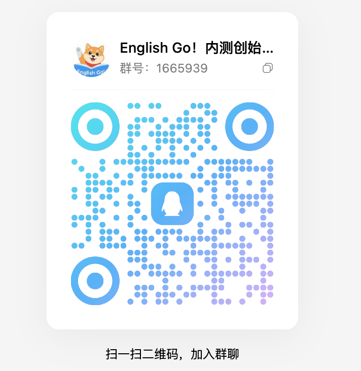

<div align="center">
  
</div>

# EnglishGo!
### AI 算法模型驱动的「无感」自主英语学习应用

`EnglishGo!` 并非一款简单的音视频播放器，也不是机械低效的背单词工具。它是一款由 **AI 算法模型核心驱动** 的深度学习软件。它打破了传统学习中“内容、练习、复习”彼此割裂的现状，将课程、音频、动态字幕、多维练习、生词库及复习曲线全自动无缝串联，为你打造一个**无感过渡、自适应循环**的闭环学习生态。

---

## 💡 缘起：为什么要做 EnglishGo!？

我们深入观察了无数英语自学者的真实困境。市面上绝大多数产品都在贩卖“内容焦虑”，却放任用户坠入两个最隐蔽、也最致命的自学恶性循环。做 EnglishGo! 的初衷，正源于我们对这种现状的极度厌倦。

**你一定经历过这种无力感——**

下载了一堆“神级”英语 App，刚打开，广告和会员弹窗先糊你一脸。想安静听节课，却要绕过积分商城、打卡挑战、社交返利，在密密麻麻的红点里，找那个小小的“播放”键。功能越做越复杂，学个习，比戒手机还难。

更讽刺的是，坚持不下去，它还会冷冰冰地告诉你——是你“不够自律”。

**但真相是**：你的意志力，在学习还没开始前，就已被那些繁琐的界面、反人性的选择、以及“今天学什么”的决策内耗彻底榨干了。你不是不自律，你只是被消耗到无力开始。

所以，我们做了 EnglishGo!。

**八个字概括它：清晰不杂乱，温和而克制。**

*   **终结内耗**：不用纠结学什么。把材料扔进去，AI 自动断句、排产，根据遗忘曲线算好你今天该练哪几句。你只需要“无脑跟”。
*   **卸下负担**：砍掉所有花哨的商业套路，只留一个让你不知不觉，从盲听过渡到跟读、复述的**无感训练舱**。

在这个浮躁的数字世界里，EnglishGo! 只想为真正想扎扎实实提升自己的人，留一片干净、纯粹、高频反馈的学习净土。

这一次，把节奏交给算法。你只管沉浸。

---

## 🎯 我们要解决什么？

在传统的英语自学路径中，用户常常陷入两个致命的断层：

1.  **决策瘫痪**：面对海量内容，每天醒来不知该学什么，将时间浪费在挑选与规划上。
2.  **无效输入**：听了成百上千小时的“磨耳朵”材料，却因缺乏稳定的输出训练，依然无法开口。

`EnglishGo!` 的核心使命，便是以 **AI 技术** 彻底弥合这两大断层：

*   **智能任务化**：AI 算法自动解构你导入或选择的音频内容，将其一键转化为高度可执行的每日渐进式学习流。
*   **输入到输出的“无感过渡”**：利用自适应算法，在不知不觉中引导你从“盲听/精听”的被动输入，平滑过渡到“跟读、复述、多维评测”的主动输出训练。

---

## 🚀 核心训练体验：AI 驱动的闭环回路

在 `EnglishGo!` 中，你无需刻意思考“接下来做什么”。一次标准的学习心流会自然发生：

> **[资源导入/选择] ➔ [AI 算法智能排产] ➔ [熏听/精听/交互练习] ➔ [难句收藏/生词捕获] ➔ [自适应动态复习]**

*   **自适应规划**：进入课程后，AI 算法会根据你当前的能力模型与遗忘曲线，精准派发当天的训练任务。
*   **无感多模态切换**：系统将依据你的听写正确率与跟读表现，自动在**盲听、精听、单词拆解、结构练习**等模式间动态切换。它拒绝盲目机械的“刷进度”，确保每一次交互都是**有高频反馈的有效练习**。
*   **数据留痕与复现**：所有在训练中暴露的生词、难句和语法盲点都将被自动捕获，并在后续的复习流中以最高优先级重新编排回练。

---

## 📱 全端开发进度看板

为了打造绝对一致的“无感闭环学习生态”，`EnglishGo!` 正在全力推进全生态端侧的齐头并进。目前客户端整体综合进度已达 **88%**。

| 目标端侧 | 核心适配特性 | 开发状态 | 实时进度 |
| :--- | :--- | :---: | :--- |
| ** iOS** | 原生 SwiftUI 高保真重构、Liquid Glass 流体玻璃美学、Haptic 触觉反馈同步 | `Beta 测试` | ██████████████████░ 95% |
| ** iPadOS** | 深度适配分屏与台前调度、针对 Apple Pencil 随手记与跟读标记行为优化 | `核心联调` | █████████████████░░ 85% |
| ** macOS** | M系列芯片原生编译、适配菜单栏轻量级唤醒模式、优化后台训练舱能耗 | `核心联调` | ████████████████░░░ 80% |
| **🤖 Android** | 现代抽象化设计自适应布局、兼容折叠屏与高刷旗舰、联调端侧动态字幕底层同步内核 | `开发中` | ███████████████░░░░ 75% |
| **🇨🇳 HarmonyOS** | 鸿蒙原生 NEXT 架构设计完成，已通过核心算法可行性验证，预计 2026.Q4 封版 | `规划中` | ████░░░░░░░░░░░░░░░ 20% |

### 🛠️ 为什么进度能推进得这么快？
因为我们在底层采用了**解耦的架构设计**：
1.  **统一的 AI 算法中枢**：任务排产、自适应遗忘曲线等核心逻辑沉淀在高性能底层内核中，多端共用一套逻辑，确保学习进度无缝同步。
2.  **UI 表现层完全原生**：在 Apple 生态坚持使用原生 SwiftUI 雕琢呼吸感界面；在 Android/鸿蒙端采用最适配的现代布局，绝不用粗暴的低性能套壳方案，确保每一个端都有丝滑、轻量的交互体验。

---

## 🎨 产品美学与气质

我们克制地雕琢 `EnglishGo!` 的每一处细节，使其具备长久陪伴的价值：

*   📐 **极简与克制**：视觉清晰无杂乱，拒绝繁琐的边框，追求让内容浮于界面之上的呼吸感。
*   🦉 **温和而不幼态**：区别于儿童化的游戏设计，提供符合成年人高级审美的、沉浸且专注的质感界面。
*   ⏱️ **轻量且有力量**：交互无压力，但底层逻辑具备极强的学习节奏与纪律感。

这不仅是一个工具，更是一个值得你长期信赖的、陪伴你突破语言天花板的英语学习算法数字教练。

---

## 🎯 谁能通过 EnglishGo! 获得最大收益？

`EnglishGo!` 是一款高饱和度的 **“训练型”** 应用，它天然吸引这样的学习者：

*   **全能力进阶者**：渴望系统性地击穿英语听、说、读、写的综合壁垒。
*   **拒绝无用功**：不满足于将英语当作背景音，追求“真正学透、学扎实”的深度学习者。
*   **自律或渴望规律**：需要每日有清晰、笃定的任务目标，并极度依赖科学复习节奏的人。
*   **语境主义者**：坚信语言必须在真实的句子、段落和高品质语境中习得，而非孤立地背诵词汇表。

---

## 🛠️ 当前核心开发进度

| 核心模块 | 功能详情 | 开发状态 | 进度条 |
| :--- | :--- | :---: | :--- |
| **AI 驱动核心** | 智能任务排产、多模态无感切换算法 | `已完成` | ████████████████████ 100% |
| **核心训练流** | 熏听/练习自适应切换、端侧动态字幕同步 | `已完成` | ████████████████████ 100% |
| **UI/UX 重构** | 首页高保真静态图重构、2.5D 微立体图标设计 | `进行中` | ██████████████░░░░░░ 70% |
| **数据与复习** | 生词捕获、自适应遗忘曲线动态编排 | `进行中` | ████████████████░░░░ 80% |
| **上架合规** | 域名解析迁移与 App 官方备案登记 | `待启动` | ████░░░░░░░░░░░░░░░░ 20% |

---

## 📅 路线图与上线排期

目前项目正处于高频迭代的冲刺阶段，整体开发进度已完成 **95%**。

*   **[已完成] 核心算法打通** `2025.Q4`
    完成 AI 智能排产与自适应动态复习的底层逻辑构建。
*   **[进行中] 界面高保真重构** `2026.Q1`
    正在进行 iOS、iPadOS、安卓端的全新 UI/UX 重构，引入更具现代抽象化设计的自适应布局。
*   **[即将到来] 核心公测** `2026.07`
    预计开启首轮 TestFlight 独家内测。
*   **[正式发布] 全量上架** `2026.Q3`
    预计正式登陆 App Store 与 Google Play。
*   **[全端打通] 生态完善** `2026.Q4`
    预计完成 iOS、iPad、安卓、鸿蒙、macOS 端的全量上架。

---

## 📢 加入内测创始用户群

现在加入 `EnglishGo! 创始用户群`，获取最新内测技术预览版：

<div align="center">
  
  <br/><br/>
  
  [点击链接加入群聊【English Go！内测创始用户#3】](https://qm.qq.com/q/aLMfD4gjtK)
  
  *Update：2026.06*
</div>

---

## 🧠 系统架构蓝图

```mermaid
graph TD
    %% 样式定义
    classDef aiStyle fill:#2196F3,stroke:#1976D2,stroke-width:2px,color:#fff;
    classDef uiStyle fill:#FF9800,stroke:#F57C00,stroke-width:2px,color:#fff;
    classDef coreStyle fill:#4CAF50,stroke:#388E3C,stroke-width:2px,color:#fff;

    %% 节点连接
    A[用户导入/选择资源] --> B(AI 算法模型核心)
    
    subgraph AI 智能动态接管层
        B --> C[智能任务排产]
        C --> D[自适应遗忘曲线编排]
    end
    
    D --> E[无感多模态训练舱]
    
    subgraph UI/UX 极致沉浸界面
        E --> F[熏听模式]
        E --> G[智能单词拆解]
        E --> H[结构化跟读复述]
    end
    
    F --> I[实时高频数据反馈]
    G --> I
    H --> I
    
    I -->|捕获生词与难句| D
    I -->|更新能力模型| B

    %% 样式绑定
    class B,C,D aiStyle;
    class E,F,G,H uiStyle;
    class A,I coreStyle;
